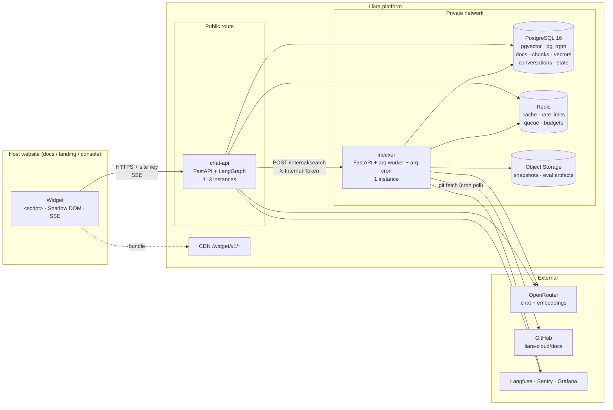
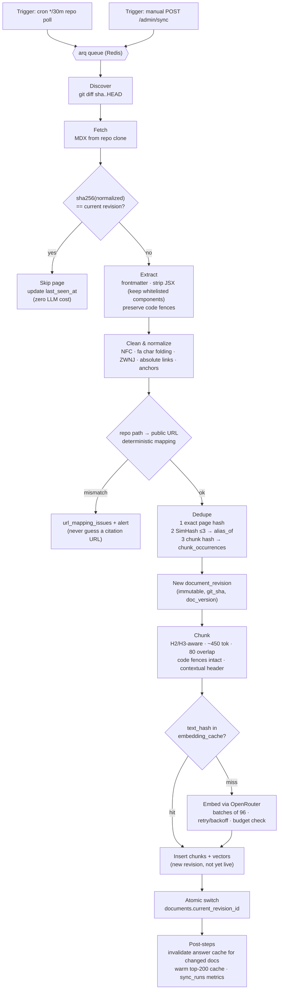
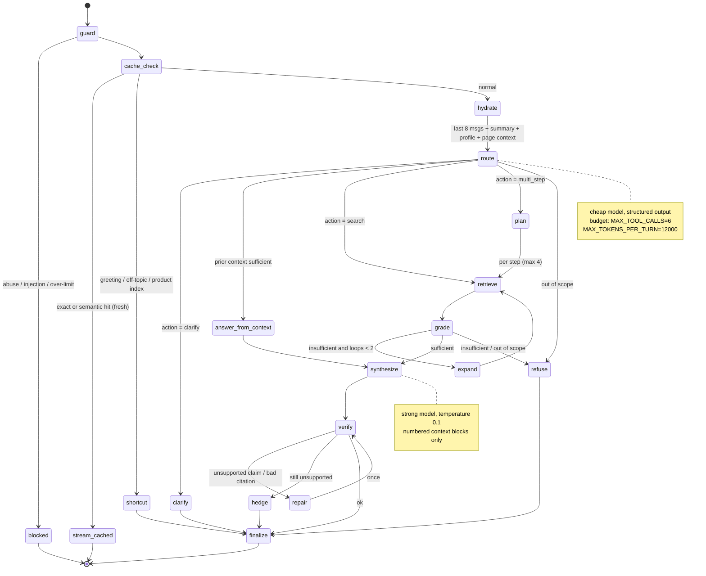
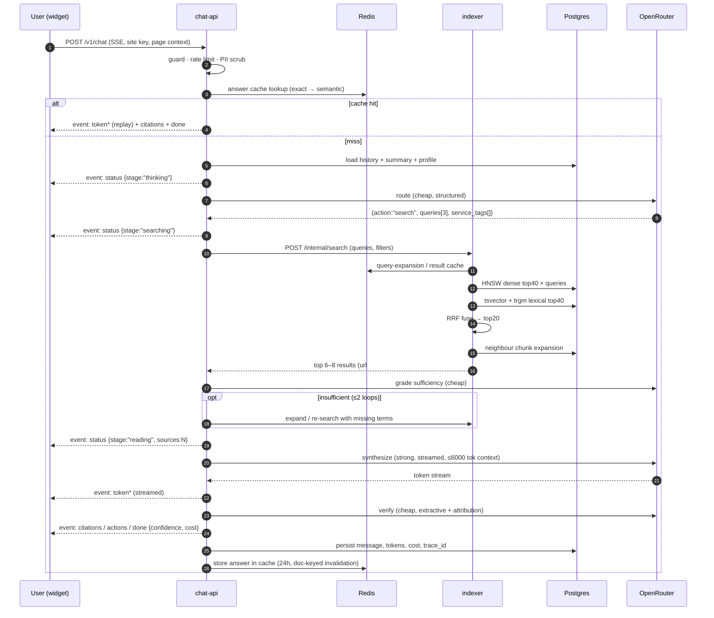
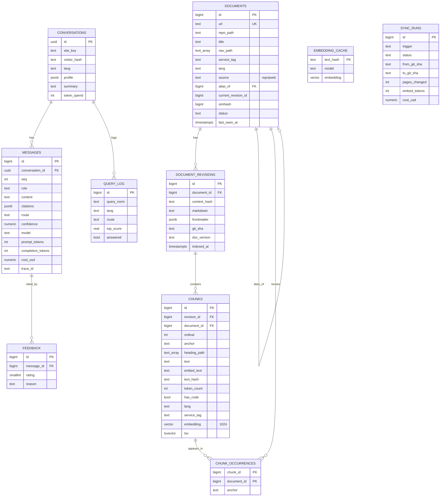
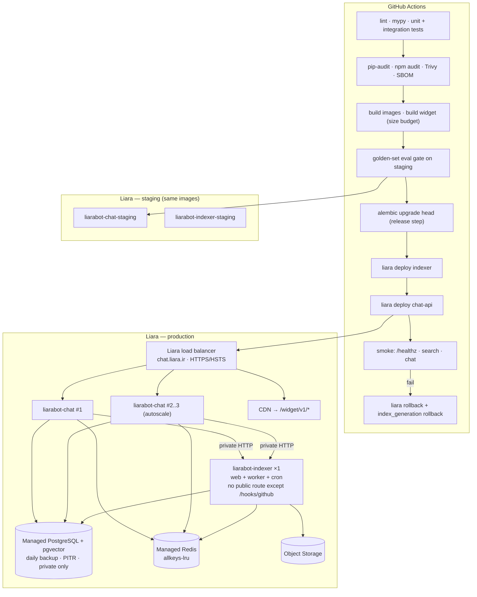
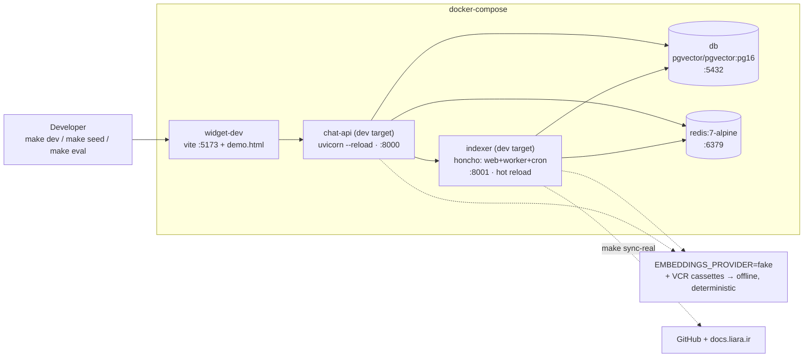
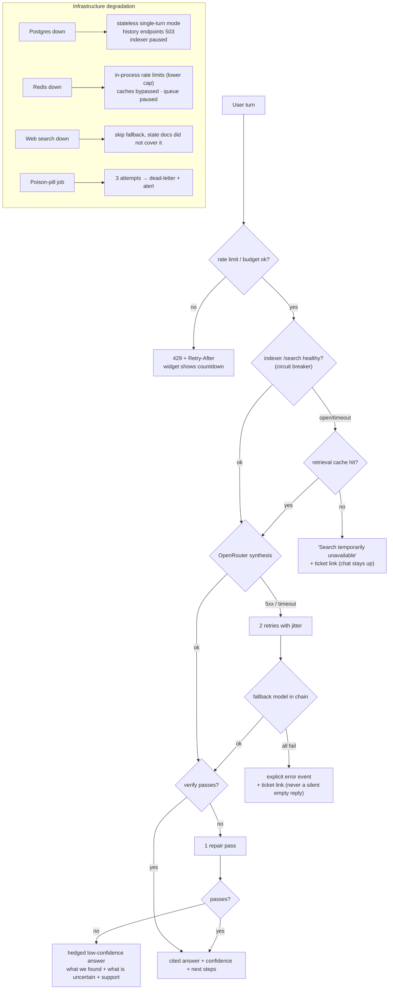
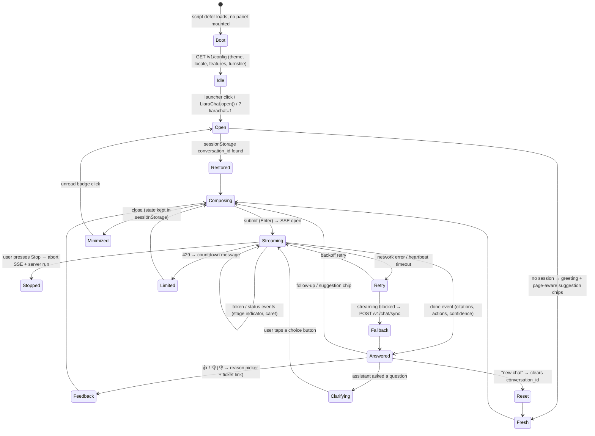

# DIAGRAMS.md — Liara Docs Chatbot

Companion to [`DESIGN.md`](DESIGN.md). All diagrams are Mermaid and render on GitHub.

| # | Diagram | Referenced from |
|---|---|---|
| 1 | System architecture | DESIGN §2 |
| 2 | Ingestion & indexing pipeline | DESIGN §4–§7 |
| 3 | Agent graph (LangGraph) | DESIGN §8 |
| 4 | Retrieval & answer sequence | DESIGN §7, §13 |
| 5 | Data model (ER) | DESIGN §6 |
| 6 | Production deployment on Liara | DESIGN §21 |
| 7 | Local Docker Compose topology | DESIGN §20 |
| 8 | Blue/green revision switch | DESIGN §2.2, §4.4 |
| 9 | Degradation / failure paths | DESIGN §17 |
| 10 | Widget state machine | DESIGN §14 |

---

## 1. System architecture

---

## 2. Ingestion & indexing pipeline

---

## 3. Agent graph (LangGraph)

---

## 4. Retrieval & answer sequence

---

## 5. Data model (ER)

---

## 6. Production deployment on Liara

---

## 7. Local Docker Compose topology

---

## 8. Blue/green revision switch (indexing never breaks reads)

```mermaid
gantt
  title Per-document blue/green write (readers always consistent)
  dateFormat  HH:mm
  axisFormat  %H:%M
  section Readers
  Serve revision N (current_revision_id = N)      :done, r1, 00:00, 12min
  Serve revision N+1                              :active, r2, 00:12, 8min
  section Writer (indexer)
  Extract · clean · chunk                          :w1, 00:02, 4min
  Embed (cache-gated, throttled)                   :w2, 00:06, 5min
  Insert chunks+vectors for revision N+1 (invisible):w3, 00:11, 1min
  Atomic UPDATE current_revision_id → N+1          :milestone, w4, 00:12, 0min
  Invalidate answer cache · warm top-200           :w5, 00:12, 3min
  Prune revision N-3 (after 90 days)               :w6, 00:15, 2min
```

Rollback = one `UPDATE documents SET current_revision_id = N`. A corpus-wide change (new chunker or embedding model) uses the same idea one level up, via `index_generation`.

---

## 9. Degradation & failure paths

---

## 10. Widget state machine

